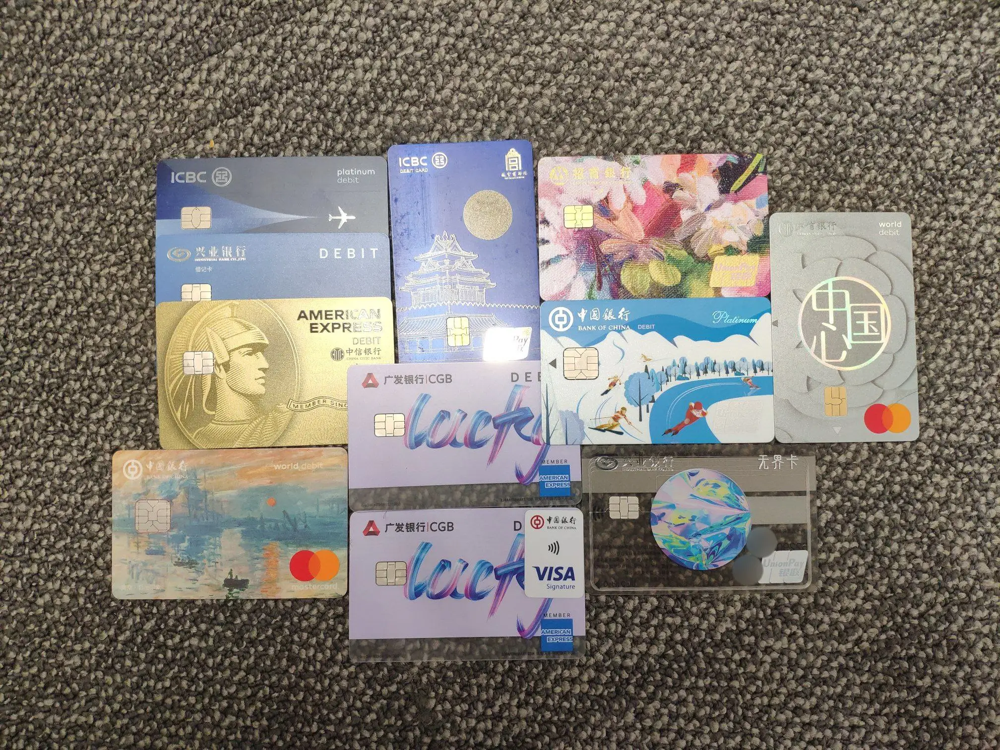

说实在，各种各样的银行卡我从今年 4 月份就开始馋了，看别人手里各种各样的银行卡，真是非常羡慕。

从最开始研究中国银行那几个网申的万事达外币借记，到收获了这么多卡，其实还是蛮有感触的。

## 合法之前，我做的准备

因为独立开户是有年龄要求的，16 岁以下只能家长带着来开户。所以，到 16 之前只能自己干等着。

当然，我也没闲着，先开了一张 招商银行 2233 花嫁的银联卡用着，拉着我妈来到招商银行的支行直接拿到了预制卡。

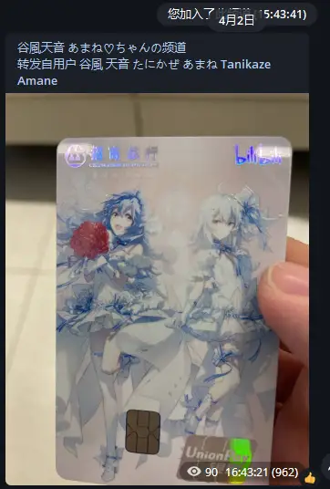

之后了解到美国运通，尝试网申，发现兴业银行和广发银行下卡没设置年龄要求，只是激活需要够 16，所以就拿到了这两个银行的美国运通借记卡，放手里但是没激活。

在之后是了解到中国银行莫奈万事达世界借记卡在北京分行开户有资产要求，需要持有中行或其它行的万事达世界（MasterCard world）或 Visa Signature，所以我又申了一个中信银行的中国心万事达世界借记卡，也是放在手里没激活。

## 北京银行，食之无味

~~纯粹是因为看错了~~，以为是 Visa Signature 结果到行拉着我妈给开出来了，结果才发现是一张 Visa Platium，大失所望，不过一直就留在钱包里了。

后来找了个时间就给销卡了，反正这卡纯废卡，没法网付，我也暂且没有电汇需求（这张卡免电汇费），真正的做到了鸡肋——食之无味，弃之可惜。

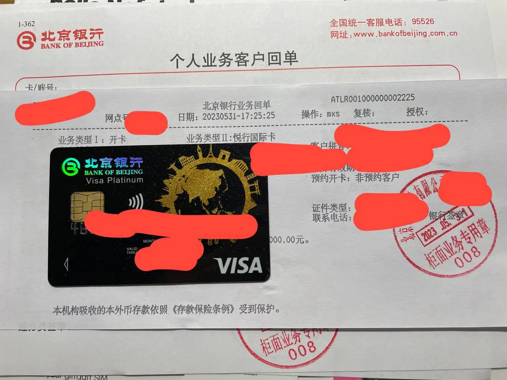

## 中信银行，来挖墙脚

刚够 16 岁的时候还在上海旅游，去上海交大参观的时候路上太热看到中信银行就进去了。顺便在那里做了中信银行中国心万事达世界卡激活。

那时候，中信银行还只是带着卡和身份证就能来激活的，我甚至开到了手机银行。

因为估计我这辈子都不会拿这张卡网付，虽然有 3ds 也能付款，但总体实用性比隔壁中国银行要大大降低，所以就开了二类，我也没再申可以用来购汇的银联一类，反正就用来挖中国银行莫奈的墙角，没实际购物要求。

值得一提的是，这张卡的的确确是一张高端卡。

后来又申请的美国运通金卡，不过一直在我包里。再去支行就被告知没有工作证明的在校学生必须带家长来激活。

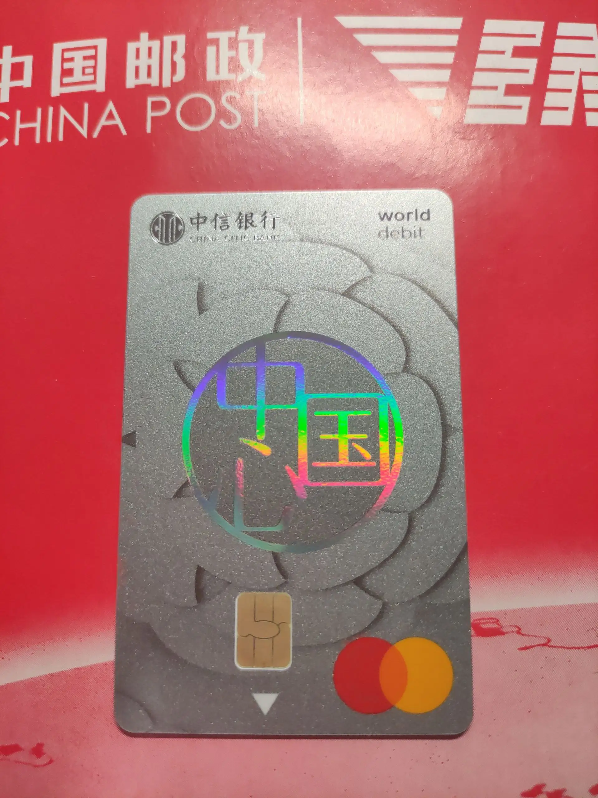 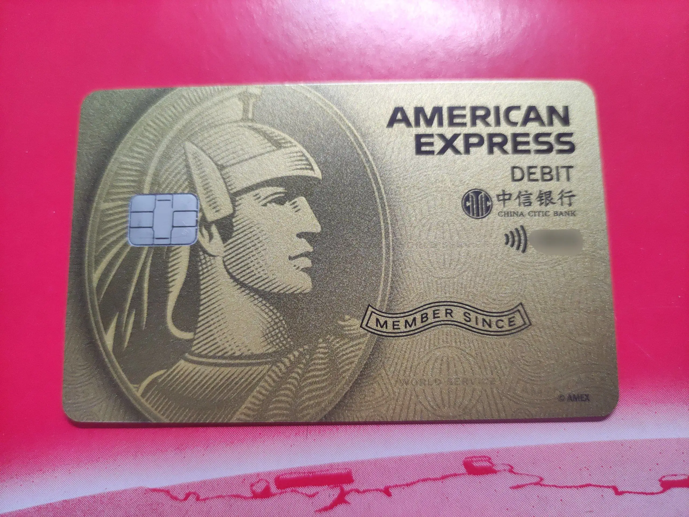

## 招商银行，销户重开

大概是因为开的时候不够 16，户也是家长带着来的，这张卡没法绑定 Apple Pay。

虽然我也不用 Apple Pay，但是就是看上去很别扭，所以我选择了销卡重开，这样就完全没有我妈的记录了。

在销卡重开之前，我还去了一趟中国移动营业厅，把我妈给我的一个手机号过户给了我。于是，我又有了一个自己本人实名的手机号。

于是，~~我又开了一个新的 2233 花嫁~~，自己的卡拿在手里确实很舒服。

不过说实话，2233 花嫁卡用多了就觉得腻了，大概是卡板问题，卡面特别容易划伤而且画面颜色也有点失，所以就同卡面换卡换了春日萌动。不得不说，油画工艺真是好看，手感还特别好。

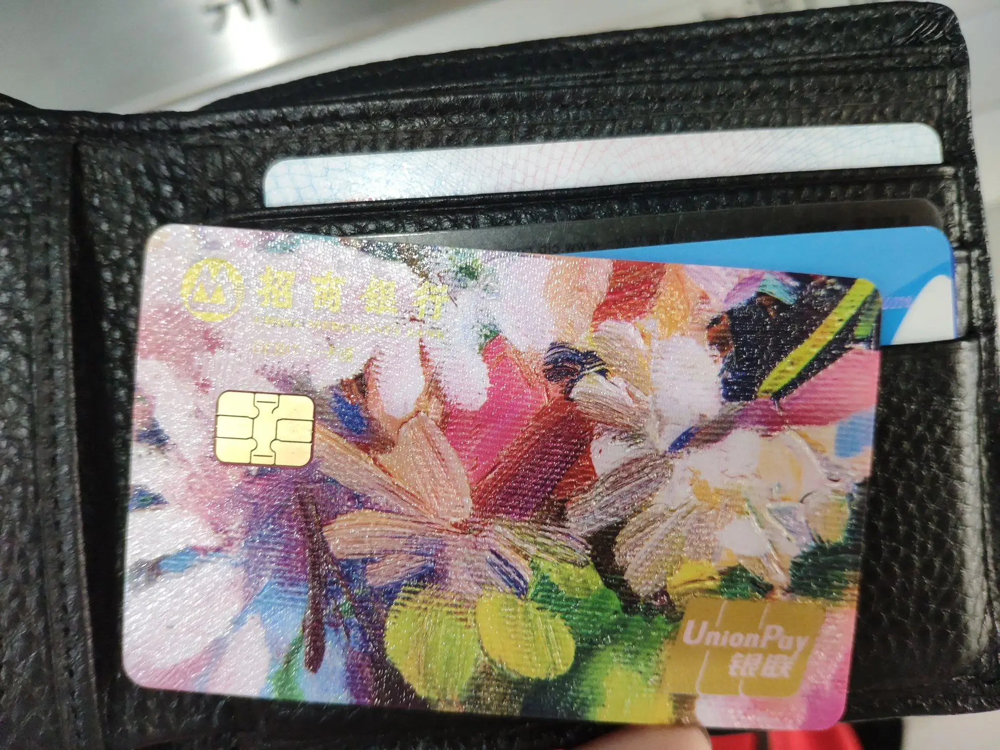

## 中国银行，心之向往

4 月份还有的洛天依小柠檬长城借记没了让我痛心了好一段时间。结果发现莫奈、非人哉都不能网申了，于是我就做好了去北京分行面申的准备。

在这之前，还听说中国银行还剩下一些冬奥会的 Visa Signature 借记卡，看到群 u 开到了京分最后一张黑色的卡，于是我下定决心，开到京分剩下的蓝卡。

于是来到京分，先是开银联电子一类卡，在柜员的耐心指导下拿到了冰雪长城借记，虽然说大堂告诉我没有莫奈和冬奥标准 Visa 卡，但我还是碰了碰运气到了柜台，还是用中信银行中国心开到了莫奈万事达世界借记，但是是大芯片，有点丑。

没有拿到冬奥标准 Visa 的我有些不甘心，又在一个周日前往了京分再去碰瓷。结果就是，他真的没有了。

但是标准卡没了，我开到了异型卡，也就是那个滑板卡。当冤大头花了 50 cny，拿来收藏和网付都挺不错的。

至此，北京大概是再也没有冬奥 Visa 了。

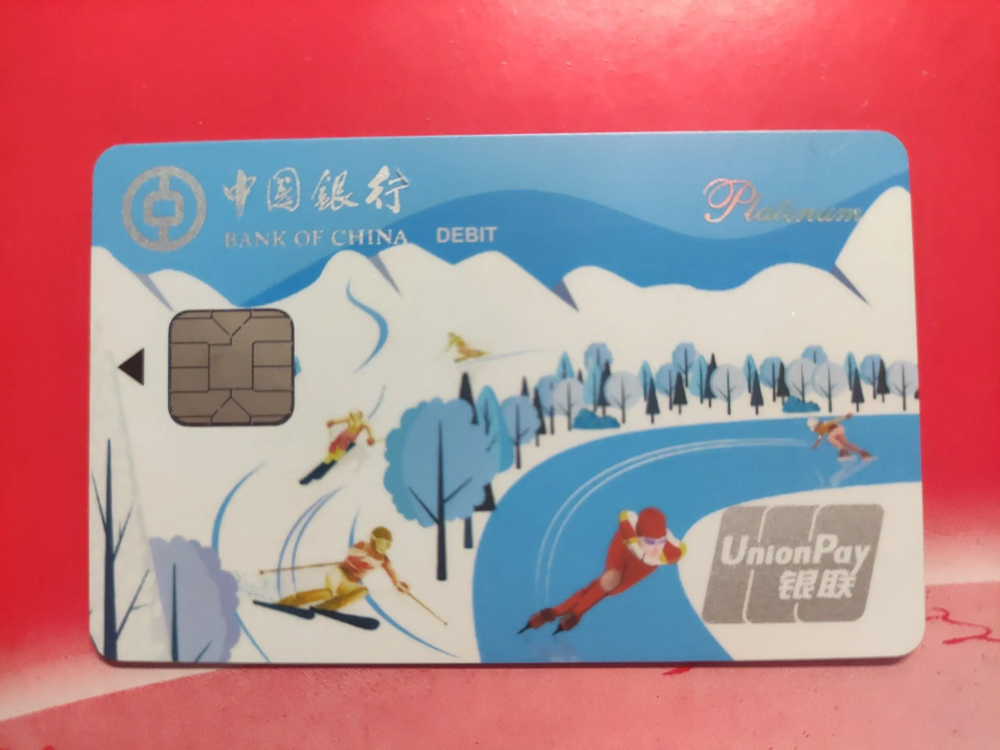 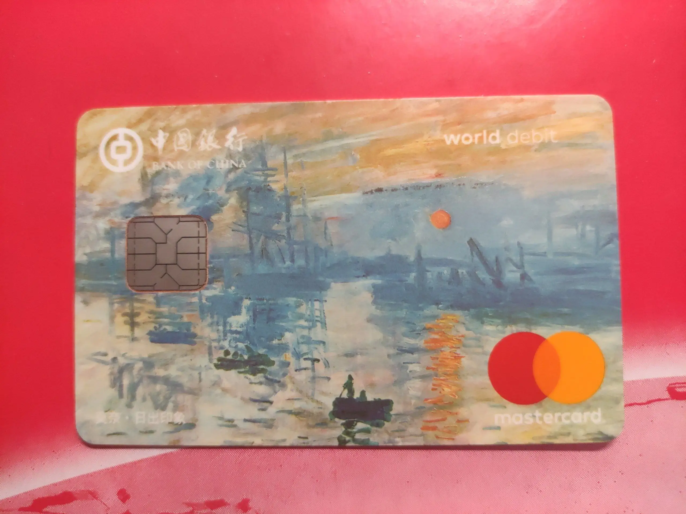 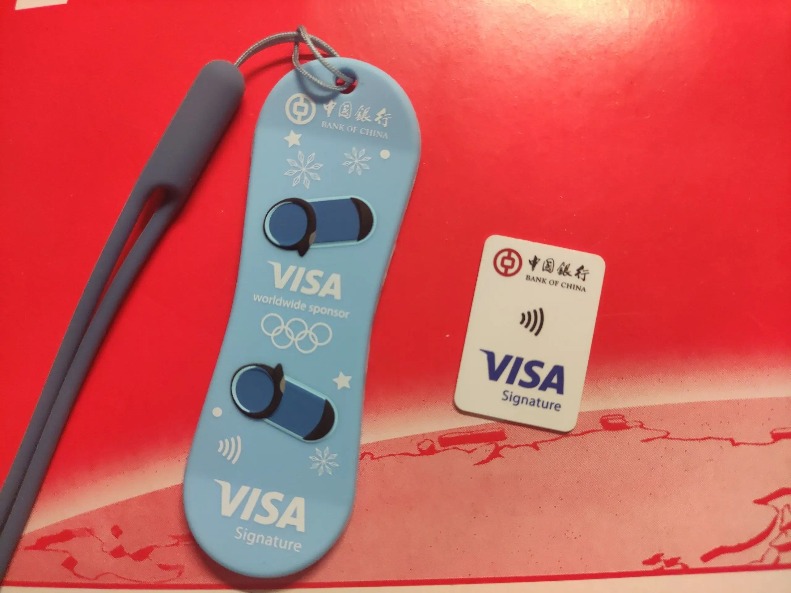

## 兴业银行，开还是不开

兴业银行的美国运通蓝盒子是我最早拿到的卡之一，一直没有激活，而且听说群 u 开出来之后因为未成年直接非柜，所以一直对兴业印象不太好。

但是，在开完了中国银行的冬奥 Visa 异型卡，看着不远处的兴业银行京分，我还是去了。

到的时候离下班还有几分钟，柜台只开了一个，经理正在换衣服准备下班，这才有惊无险地输了口气，总算是赶上了。

于是在群 u 的指导下，在 VTM 上开了兴业银行无界卡，当作我的一类卡，顺便还激活了我一直没激活的蓝盒子美国运通，也没有非柜，作了我的二类卡，群 u 也就是在这里解除了非柜。果然大分行对于小屁孩就是好。

兴业无界卡在云闪付消费有 cashback，所以就把他当作了我的小额付款卡咯。

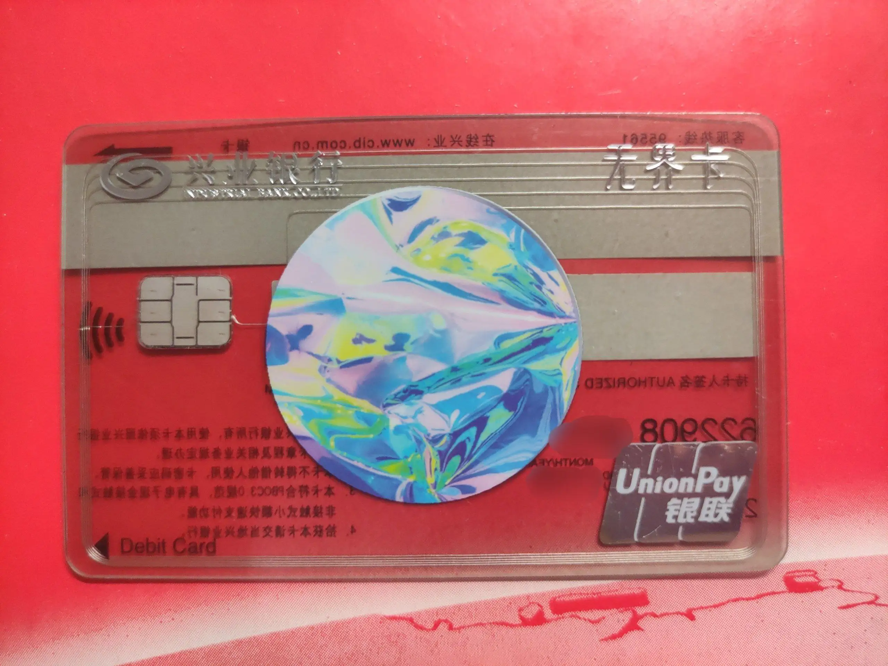 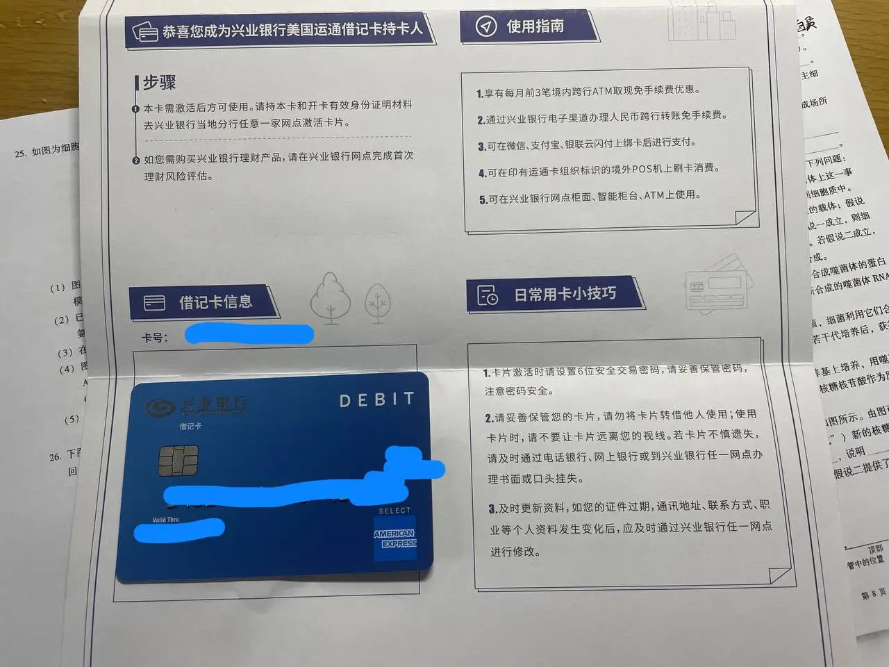

## 广发银行，德才兼备

广发银行的 lucky 美国运通一直是我认为最好看的卡面之一。而且据说网付起来很好用，所以就去了银行做了激活。

事实证明，他确实非常好用，而且他的卡头 `370330` 会被识别成信用卡，也就是 credit，所以还能绑定 Vultr 之类的，但是我用不着。

于是我还有病一样开了两张 lucky，一张作一类，一张作二类，虽然没有卵用，但是我就是这么干了。因为不够 18 岁所以也没有手机银行之类的。

值得一提的是如何给广发这张卡入金。中国银行手机银行可以给卡里面汇款，但是我不是很喜欢用中行手银。云闪付也没办法转账。所以最后选定了数字人民币。只有微众银行能绑定这张 lucky 卡。从别的行转到里面 0 手续费，非常爽。

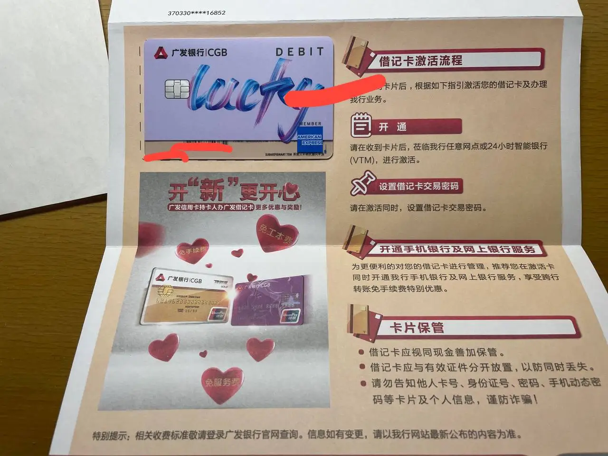 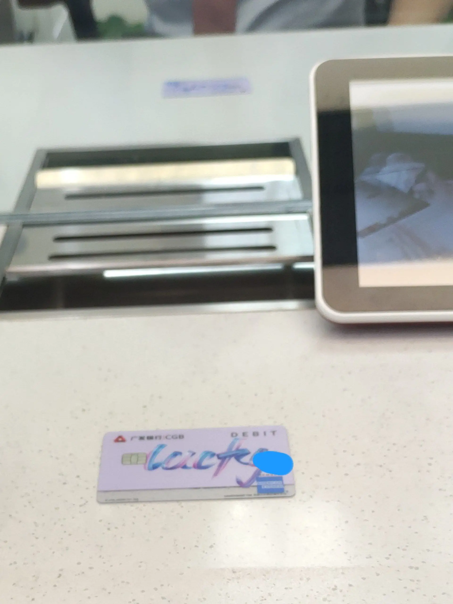

## 中国工商，共驱之

中国工商的银联卡纯粹闲的，找了一天放学，16:45 下课从学校飞出来到了最近的一个工商支行，开到了一张银联，是故宫博物院的联名卡，但是卡板有点脏脏的，也没有手机银行。

但是重头戏是牡丹国际借记卡，一直听说牡丹卡好用，而且牡丹卡虽然是万事达卡，但是他恐怕是唯一一张国有银行发行的海外卡组织但是有人民币户的借记卡，中行莫奈，中信中国心都没有人民币户，但是牡丹卡有。

群 u 在金融街支行被拒了，然后居然在惠新支行开出来了，还是新卡板，二话不说，当天下午我从朝阳门飞到了惠新，开出来了卡。

~~当时还很默契的和群 u 打配合，都说是一起去日本旅游的同学。~~

可惜的是支行依然不给我授权手机银行，但是我看好像可以作自助注册，于是也就开了。

值得注意的是，这张卡有 1.1% 货币转换费。

试了试 Mid Journey（Stripe 收单），Telegram Premium 和 Steam，都付款成功了，但是必须得有美元。

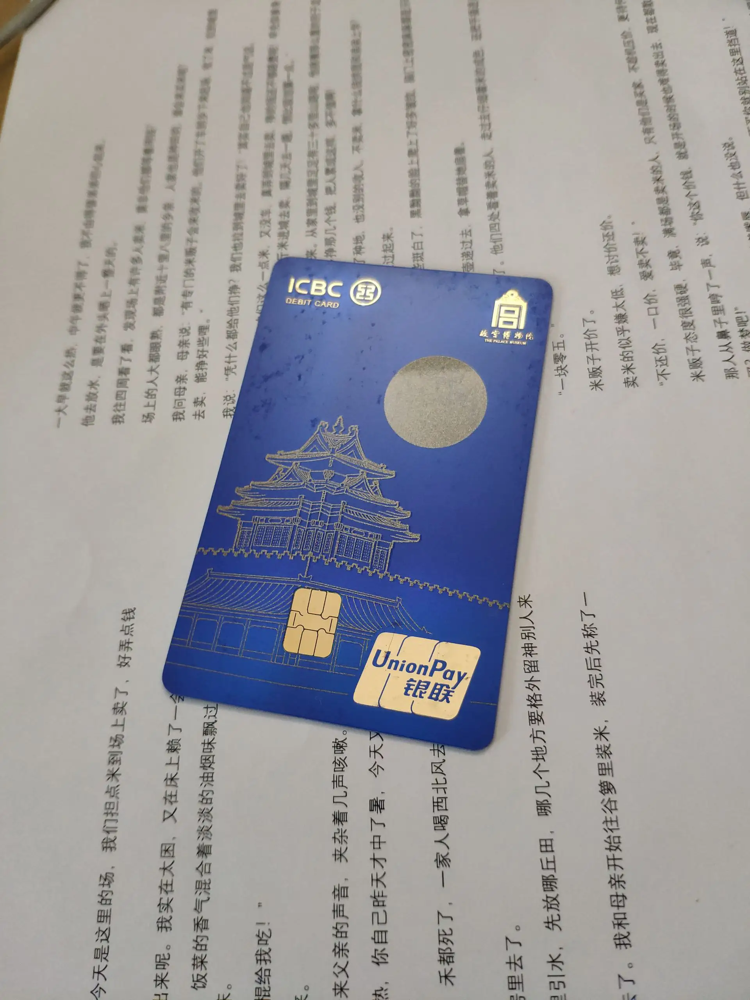 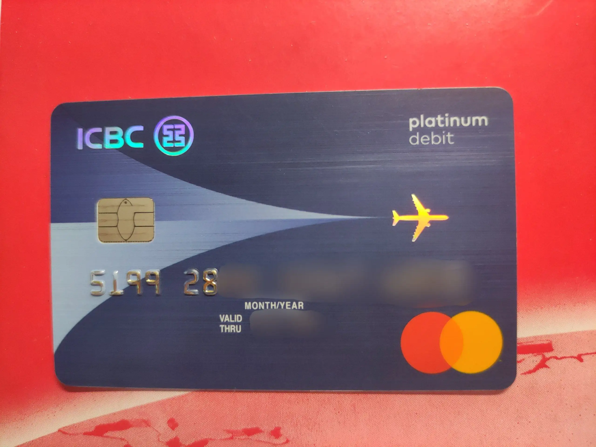
