In this tutorial, we will install ```Ubuntu 20.04.2 LTS```
本文部分摘自

<script type="text/javascript">
 
window.onload=function(){
		var LinkCards=document.getElementsByClassName('LinkCard');
		if(LinkCards.length != 0){
		var LinkCard=LinkCards[0];
		var link=LinkCard.href;
		var title=LinkCard.innerText;
		LinkCard.innerHTML="<style type=text/css>.LinkCard,.LinkCard:hover{text-decoration:none;border:none!important;color:inherit!important}.LinkCard{position:relative;display:block;margin:1em auto;width:390px;box-sizing:border-box;border-radius:12px;max-width:100%;overflow:hidden;color:inherit;text-decoration:none}.ztext{word-break:break-word;line-height:1.6}.LinkCard-backdrop{position:absolute;top:0;left:0;right:0;bottom:0;background-repeat:no-repeat;-webkit-filter:blur(20px);filter:blur(20px);background-size:cover;background-position:center}.LinkCard,.LinkCard:hover{text-decoration:none;border:none!important;color:inherit!important}.LinkCard-content{position:relative;display:flex;align-items:center;justify-content:space-between;padding:12px;border-radius:inherit;background-color:rgba(246,246,246,0.88)}.LinkCard-text{overflow:hidden}.LinkCard-title{display:-webkit-box;-webkit-line-clamp:2;overflow:hidden;text-overflow:ellipsis;max-height:calc(16px * 1.25 * 2);font-size:16px;font-weight:500;line-height:1.25;color:#1a1a1a}.LinkCard-meta{display:flex;margin-top:4px;font-size:14px;line-height:20px;color:#999;white-space:nowrap}.LinkCard-imageCell{margin-left:8px;border-radius:6px}.LinkCard-image{display:block;width:60px;height:auto;border-radius:inherit}</style><span class=LinkCard-backdrop style=background-image:url(https://zhstatic.zhihu.com/assets/zhihu/editor/zhihu-card-default.svg)></span><span class=LinkCard-content><span class=LinkCard-text><span class=LinkCard-title>"+title+"</span><span class=LinkCard-meta><span style=display:inline-flex;align-items:center>​<svg class="+"'Zi Zi--InsertLink'"+" fill=currentColor viewBox="+"'0 0 24 24'"+" width=17 height=17><path d="+"'M6.77 17.23c-.905-.904-.94-2.333-.08-3.193l3.059-3.06-1.192-1.19-3.059 3.058c-1.489 1.489-1.427 3.954.138 5.519s4.03 1.627 5.519.138l3.059-3.059-1.192-1.192-3.059 3.06c-.86.86-2.289.824-3.193-.08zm3.016-8.673l1.192 1.192 3.059-3.06c.86-.86 2.289-.824 3.193.08.905.905.94 2.334.08 3.194l-3.059 3.06 1.192 1.19 3.059-3.058c1.489-1.489 1.427-3.954-.138-5.519s-4.03-1.627-5.519-.138L9.786 8.557zm-1.023 6.68c.33.33.863.343 1.177.029l5.34-5.34c.314-.314.3-.846-.03-1.176-.33-.33-.862-.344-1.176-.03l-5.34 5.34c-.314.314-.3.846.03 1.177z'"+" fill-rule=evenodd></path></svg></span>"+link+"</span></span><span class=LinkCard-imageCell></span></span>";

		for (var i = LinkCards.length - 1; i >= 1; i--) {
		LinkCard=LinkCards[i];
		title=LinkCard.innerText;
		link=LinkCard.href;
		LinkCard.innerHTML="<span class=LinkCard-backdrop style=background-image:url(https://zhstatic.zhihu.com/assets/zhihu/editor/zhihu-card-default.svg)></span><span class=LinkCard-content><span class=LinkCard-text><span class=LinkCard-title>"+title+"</span><span class=LinkCard-meta><span style=display:inline-flex;align-items:center>​<svg class="+"'Zi Zi--InsertLink'"+" fill=currentColor viewBox="+"'0 0 24 24'"+" width=17 height=17><path d="+"'M6.77 17.23c-.905-.904-.94-2.333-.08-3.193l3.059-3.06-1.192-1.19-3.059 3.058c-1.489 1.489-1.427 3.954.138 5.519s4.03 1.627 5.519.138l3.059-3.059-1.192-1.192-3.059 3.06c-.86.86-2.289.824-3.193-.08zm3.016-8.673l1.192 1.192 3.059-3.06c.86-.86 2.289-.824 3.193.08.905.905.94 2.334.08 3.194l-3.059 3.06 1.192 1.19 3.059-3.058c1.489-1.489 1.427-3.954-.138-5.519s-4.03-1.627-5.519-.138L9.786 8.557zm-1.023 6.68c.33.33.863.343 1.177.029l5.34-5.34c.314-.314.3-.846-.03-1.176-.33-.33-.862-.344-1.176-.03l-5.34 5.34c-.314.314-.3.846.03 1.177z'"+" fill-rule=evenodd></path></svg></span>"+link+"</span></span><span class=LinkCard-imageCell></span></span>";
		}
	}
}
</script>
<a href="https://www.littleqiu.net/ubuntu-to-go/" class="LinkCard">Ubuntu To Go | 制作属于你的随身 Ubuntu 系统盘</a>

## 准备

- 一个大于 8 GB 的可移动储存设备
- [Vmware Workstation](https://www.vmware.com/products/workstation-pro/workstation-pro-evaluation.html)
- Ubuntu [安装盘](https://mirrors.ustc.edu.cn/ubuntu-releases)
- 一个可以联网的计算机

## 安装

### 准备虚拟机

插入你的储存设备

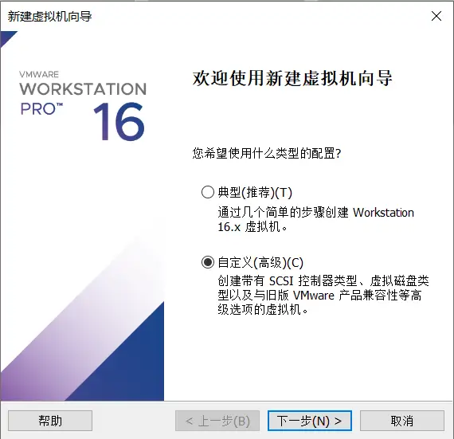 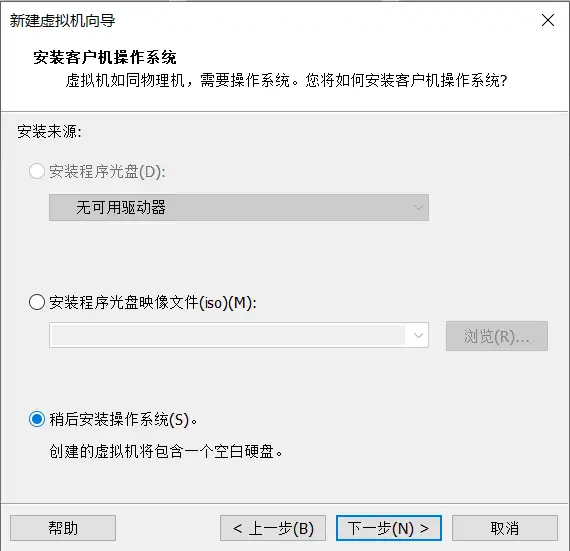

接下来设置磁盘。这是决定你的系统安装位置的设置项。

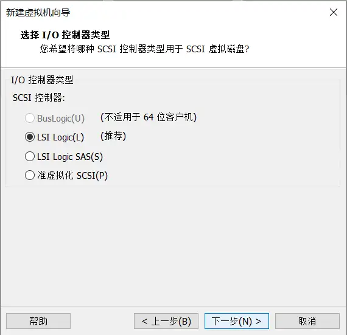  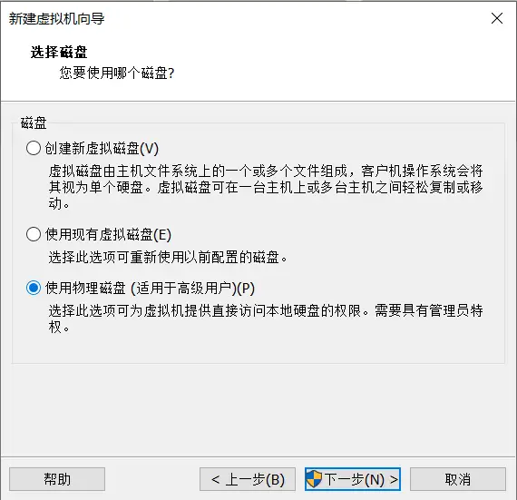

这个时候就要小心一点了，因为要设置安装的硬盘。你可以根据你的电脑有几个实体硬盘来判断。比如只有一个实体硬盘的你新插入的U盘应该是 PhysicalDrive 1，如果有两个则是 PhysicalDrive 2。如果你不确定的话可以右键此电脑，选择「管理」，点击「磁盘管理」，查看盘号。

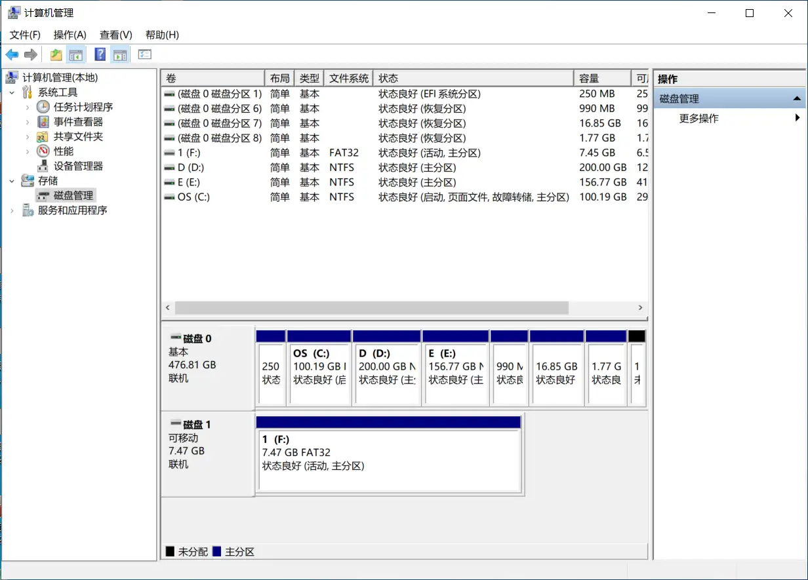

如果 Vmware 没有识别到你的储存设备，多半是因为先打开的 Vmware 后插入储存设备，这个时候你需要关掉 VMware 重新打开。

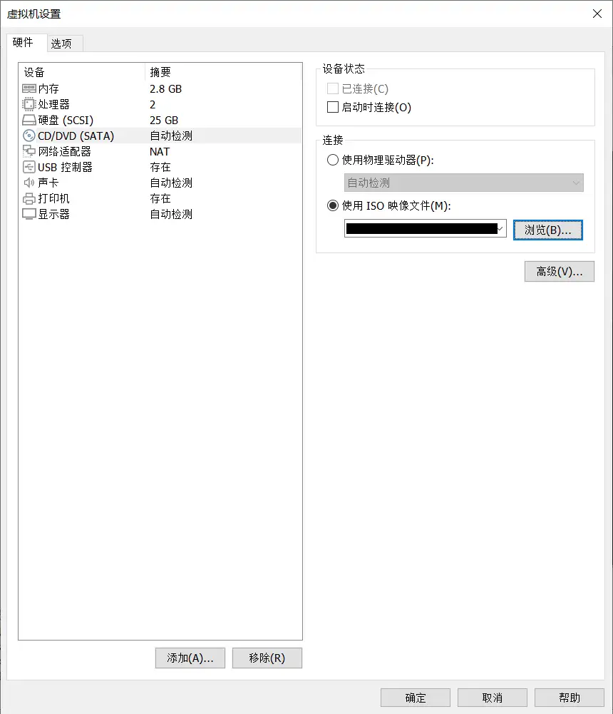

### 安装 Ubuntu

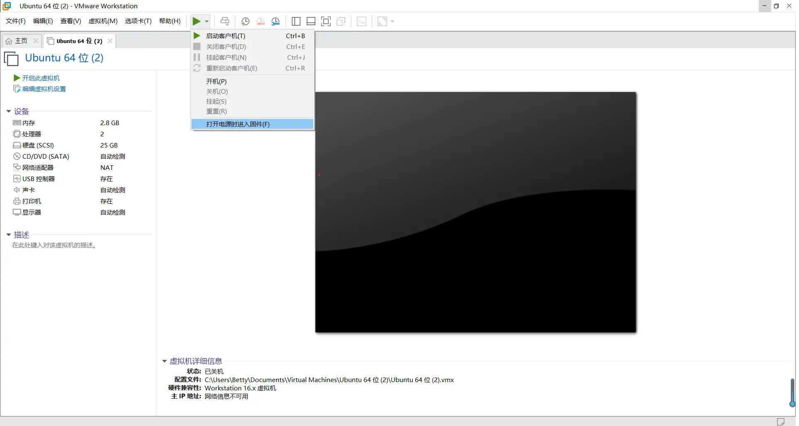 

在安装界面选择「试用 Ubuntu」

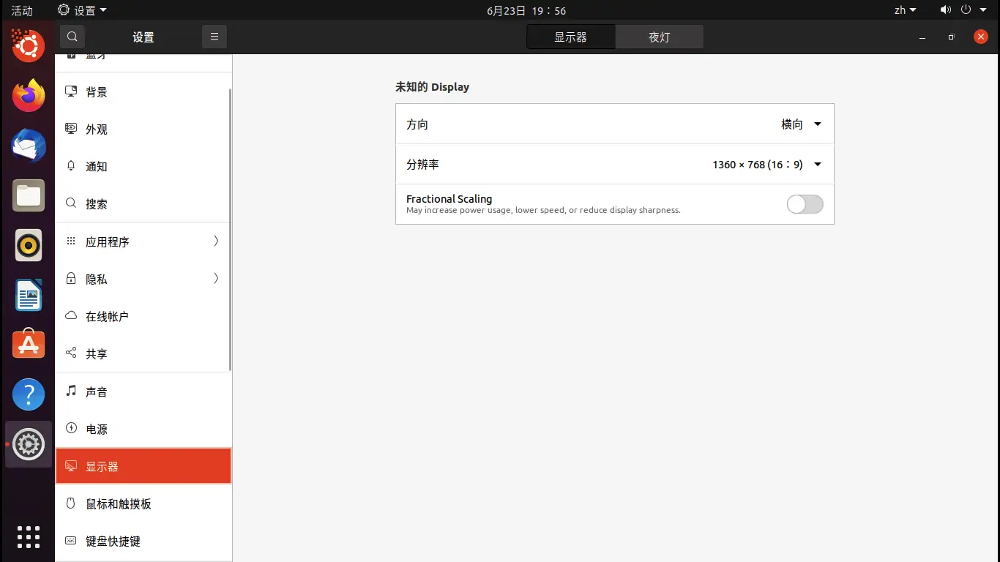
点击桌面的安装程序进行常规安装。在选择安装类型的时候要选「其他选项」。我们要对硬盘进行分区。

>一般来说全新的 U 盘都会有一个 FAT32/NTFS/exFAT 分区，把这个分区删掉。在磁盘前部建立一个大小为 200MB 的 FAT32 分区作为 EFI 分区，必须是主分区，挂载点为 /boot/efi。然后建立根分区（挂载点为 /），这个分区也必须是主分区。你可以按你的喜好来配置根分区，我的建议是分区大小不小于 10GB，分区格式为 EXT4。你也可以按照个人喜好给 /usr，/home，/var，/tmp 等目录单独划分分区。如果你的 U 盘容量比较大，可以在磁盘后部留下一点空闲的空间，安装完成后把这部分空间单独划分出一个 NTFS 分区来，你的 Ubuntu To Go 系统盘还能继续当 U 盘使。————摘自[《Ubuntu To Go | 制作属于你的随身 Ubuntu 系统盘 | DreamCity》](https://www.littleqiu.net/ubuntu-to-go/)

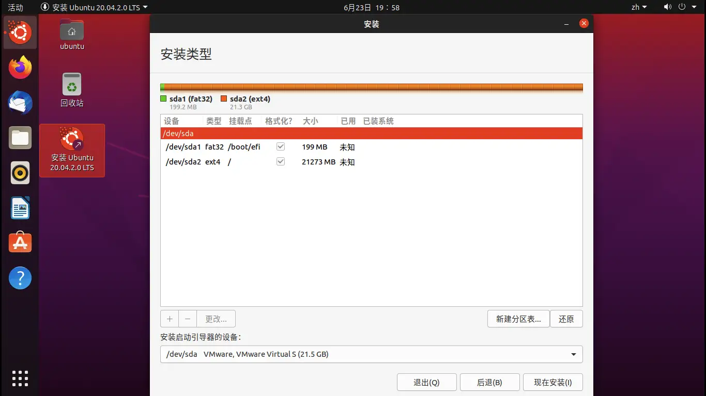

如果你确定你做好了分区，那么就点击「现在安装」进行下一步的配置。一般来说也是一路 Next 下去，设置一下个人信息就好了。如果确认设置无误，可以正式开始安装。因为储存设备的读写性能比较低而且虚拟机有性能损耗，安装过程会比较长，不过一般都会在一个小时内结束。（所以建议拿读写速度快的硬盘安装）
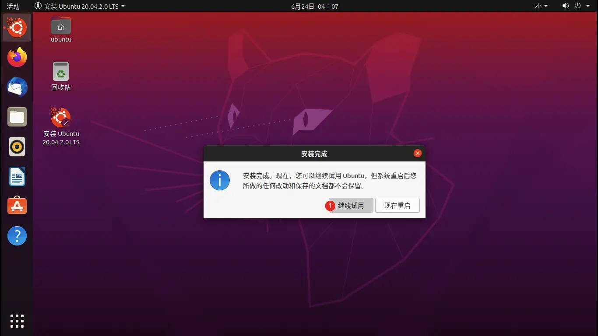 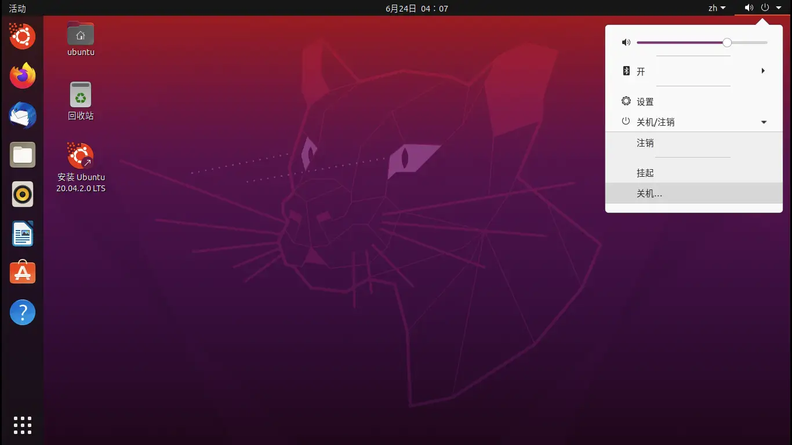

对于 `21.04` 及以上版本的 Ubuntu，你已经完成了安装，此时可以拔下 U 盘启动到 Ubuntu To Go，但对于 `21.04` 以下的版本，请参照下面的内容继续安装 `grub-efi`。

### 安装 grub-efi

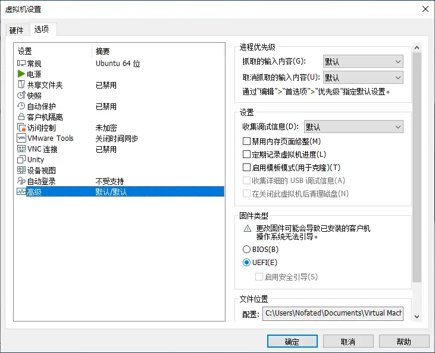 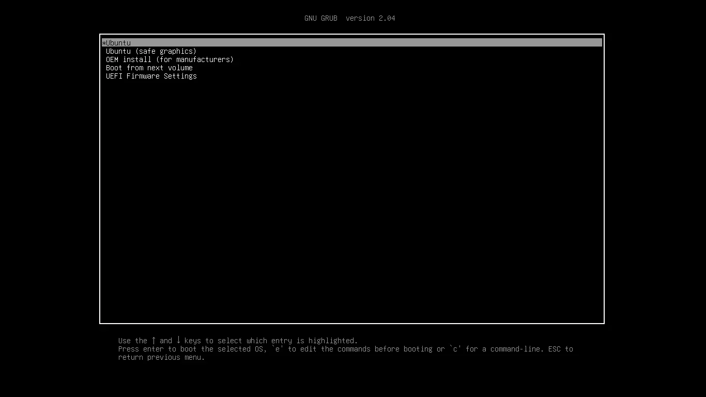

在 LiveCD 中，打开终端

```shell 获取 root 权限
$ sudo -s
```

```shell 查看分区
$ fdisk -l
```
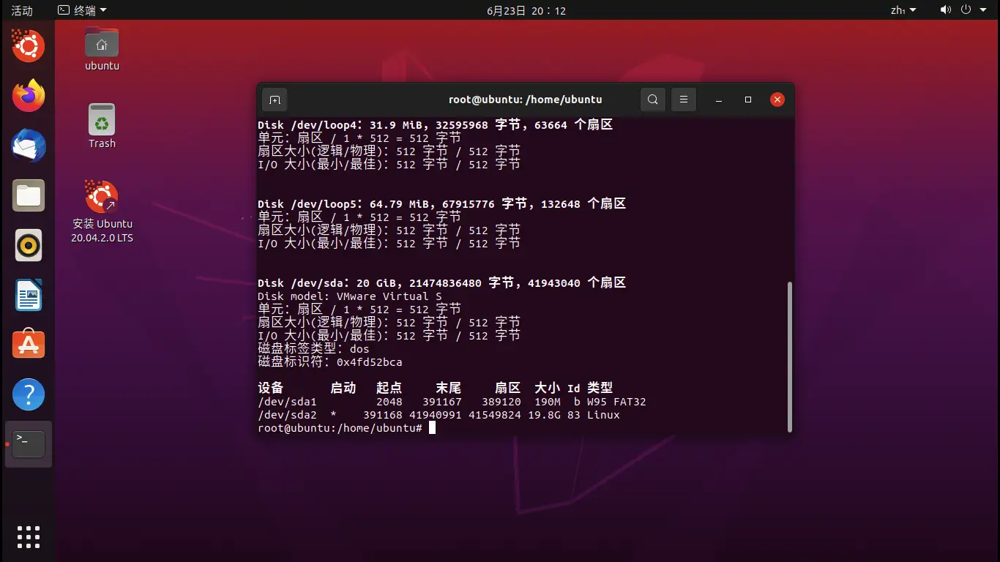
```shell 挂载分区
$ mount /dev/sda2 /mnt
$ mount /dev/sda1 /mnt/boot/efi
$ mount --options bind /dev /mnt/dev
$ mount --options bind /proc /mnt/proc
$ mount --options bind /sys /mnt/sys
$ mount --options bind /run /mnt/run
# 如果你有划分其他分区，最好也挂载它们。如下指令为挂载 /dev/sda3 为 /home。
# mount /dev/sda3 /mnt/home
```

>不同情况均存在差异，将 sda1 或 sda2 更换为实际情况即可。在挂载时要先挂载根分区再挂载 EFI 分区。

```shell 进入 Chroot 环境
$ chroot /mnt
```

```shell 安装 grub-efi
$ apt-get install grub-efi
```

```shell 报错
正在读取软件包列表...
完成正在分析软件包的依赖关系树
正在读取状态信息... 完成
有一些软件包无法被安装。如果您用的是 unstable 发行版，这也许是因为系统无法达到您要求的状态造成的。该版本中可能会有一些您需要的软件包尚未被创建或是它们已被从新到(Incoming)目录移出。下列信息可能会对解决问题有所帮助：
下列软件包有未满足的依赖关系： 
grub-efi : 
依赖: grub-common (= 2.04-1ubuntu26.2) 但是 2.04-1ubuntu26.8 正要被安装
依赖: grub-efi-amd64 (= 2.04-1ubuntu26.2) 但是它将不会被安装
E: 无法修正错误，因为您要求某些软件包保持现状，就是它们破坏了软件包间的依赖关系。
```
>如上，我在安装 `grub-efi` 时发生了报错，其实这个问题很好解决

```shell BASH
$ sudo apt-get purge grub-common
$ sudo apt-get update
$ sudo apt-get upgrade
$ sudo apt-get install grub-efi
```
通过这个指令一般可以解决依赖关系的问题。
```shell 换源
$ cp /etc/apt/sources.list /etc/apt/sources.list.bak
$ sed -i 's/archive.ubuntu.com/mirrors.163.com/g' /etc/apt/sources.list
# 你需要根据你的时区来更换 archive.ubuntu.com，比如中国的时区是 cn.archive.ubuntu.com
```

```shell 安装引导
$ grub-install --target=x86_64-efi --boot-directory=/boot/efi --efi-directory=/boot/efi --removable
```

```shell 退出 chroot
$ umount /proc
$ umount /dev
$ umount /sys
$ umount /run
$ sync
$ exit
```

```shell 复制配置文件
$ cp '/mnt/boot/grub/grub.cfg' '/mnt/boot/efi/grub'
```
重启即可看到，已经引导到 Ubuntu To Go 启动而不是光驱了。你可以再次关机，更改虚拟机设置中的启动模式设置项来分别测试在 Legacy BIOS 和 EFI 下的运行情况。你也可以关闭物理机，然后在 BIOS 中将第一启动设备设为 Ubuntu To Go 系统盘，即可在实体机上运行 Ubuntu To Go 系统盘中的 Ubuntu。

>大功告成！欢迎使用 Ubuntu To Go！拔下你的储存设备，插到其他电脑上试试吧！

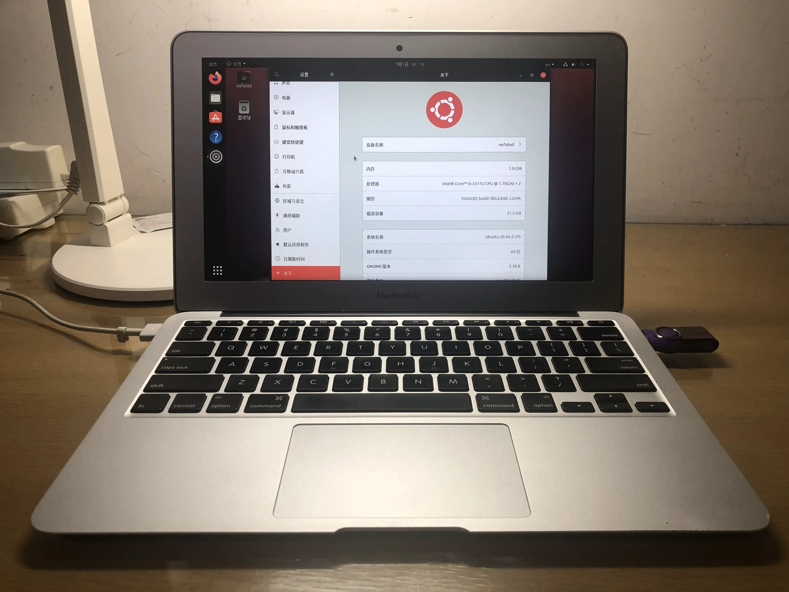

## 一些小问题

有的同志说开机之后执行了 `sudo apt-get upgrade` 导致重启后无法开机。我判断是 vmlinuz 更新导致了问题。

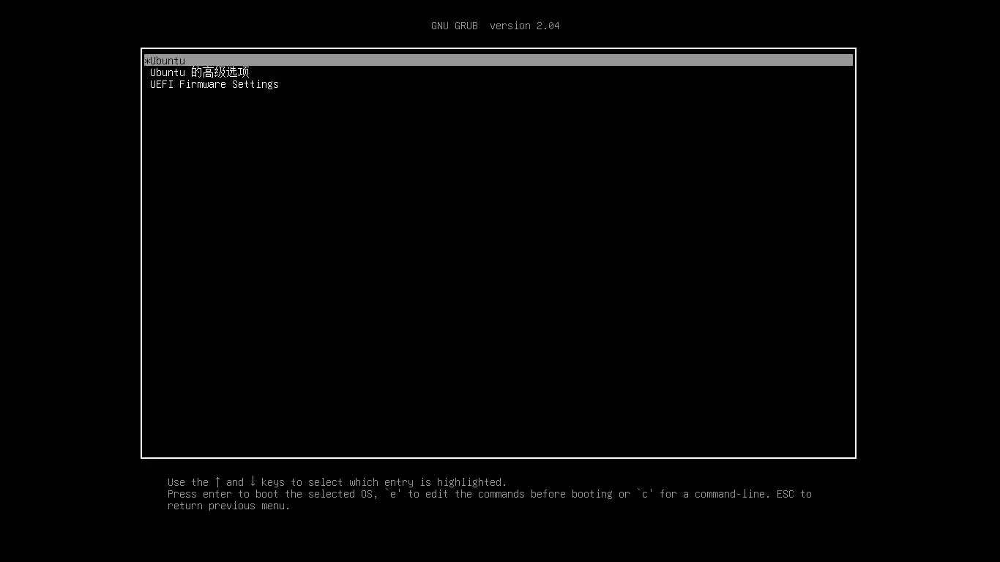 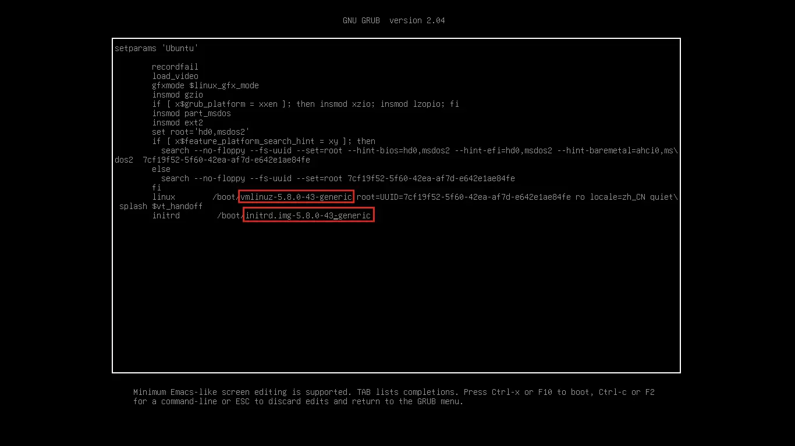
