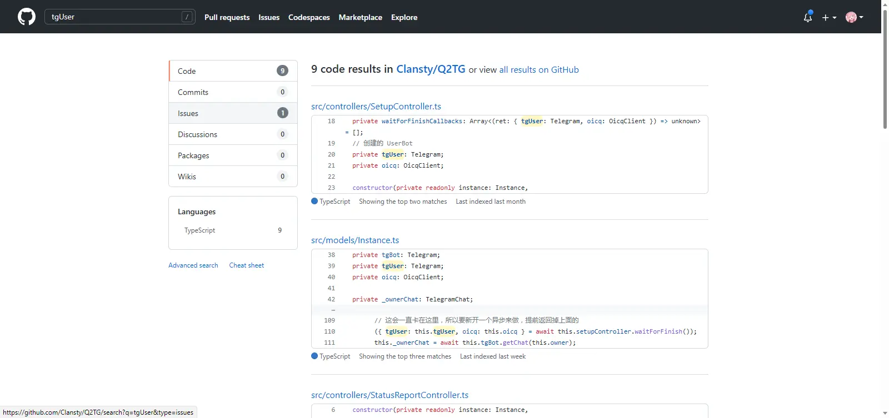
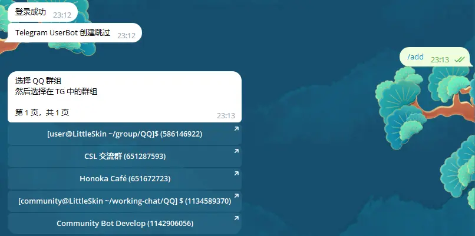
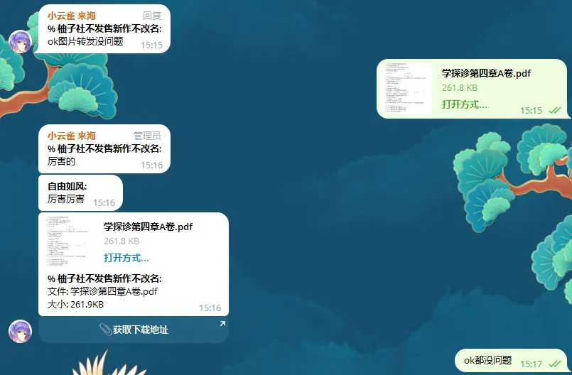

## 引言

今年 1 月份中下旬，因为原本 LittleSkin 运营组使用的 *Constance* 转发机器人年久失修，转发功能基本寄了，于是 *LittleSkinCommspt* 协助构建了一个新的 *QQ* 和 *Telegram* 之间相互转发的机器人，基于 [Clansty/Q2TG](https://github.com/Clansty/Q2TG)。后来因为种种原因，这个 *Q2TG* 无法再给社区使用，于是我就主动~~插手~~构建了一个新的 *Q2TG* 实例。

- **1 月 16 日** 注册了一个 `+1` 的 Telegram 账号作为 Q2TG 创建时注册的 User Bot，在部署完成后，我发现此 Telegram 账号立刻被封禁，但是 Q2TG 本身功能并没有发生影响，于是我就没太在意。
- **1 月 18 日** 在正常工作两天后的凌晨，我注意到机器人似乎出了故障，图片和表情均无法转发，这不免让我有些疑惑，于是我重新启动了 Docker 容器，然后就发现转发彻底寄了，一看后台，原来最让人担心的 User Bot 还是寄了，`USER_DEACTIVATED_BAN`，Q2TG 报错，直接导致整个转发寄了。于是早上又尝试了 [`v1`](https://github.com/Clansty/Q2TG/tree/main) 版本，机器人勉强工作，也就继续用了。然后下午又注册了一个新的 `+1` 的 Telegram 账号，简单养了养号后又怀揣着忐忑的心情重新部署了一遍，然后我的 Telegram 账号就又寄了...

> 我艹你喵杜叔叔，全家死光光！喵的！很明显这是中了杜叔叔的风控了，浪费了两个号...

## 看看 Issues 叭！

既然封了两次，我是不敢再拿我大号作死，于是我就打算看看 Issues 里面有没有人和我出现了一样的问题。

果不其然我就看到了~~在我之前尝试部署 Q2TG 的 [金姐姐](https://github.com/jinzhijie)~~ [Clansty/Q2TG#74](https://github.com/Clansty/Q2TG/issues/74) [Clansty/Q2TG#83](https://github.com/Clansty/Q2TG/issues/83)。一些人也是出现了无法登录 User Bot 的情况，也有人希望能禁用 User Bot。

但是 Issues 并没有帮我解决什么，但是至少知道了以下几点：

- User Bot 在 v1 中是作为类似于插件安装的，可以不进行配置
- User Bot 在群发功能中基本上只起到一个检测 Telegram 上消息撤回的功能

也就是说，按照现在的情况，如果我们可以舍弃检测 Telegram 上原生消息撤回，那 User Bot 模式确实有些没必要，毕竟部署的 Q2TG 是给 *LittleSkin* 的一系列群组使用的。

那有什么办法能去除 Q2TG 吗？User Bot 模式已经写死在了代码里，那也就只能———

## 分析与修改代码

[Clansty/Q2TG](https://github.com/Clansty/Q2TG) 的最新版本 `v3`，也就是 `rainbowcat` 是基于 *TypeScript* 开发的。那就开始吧！但是从哪里开始呢？在随意翻看了几个文件后，我将视线锁定在了 `tgUser` 这个变量上。~~因为写的真的太明显了，简直就是一眼丁真。~~

于是我尝试在 GitHub 搜索了一下，没想到就可以直接开始肝了（



### ❌ 脑瘫思路 —— Undefined

分析了一下之后，我就打算开始着手删掉 `tgUser` 相关的内容。但在删到快一半的时候，我突然~~脑溢血地~~想到，如果我们在功能实现的部分保留所有的 `tgUser`，但是我们让他在传参时动动手脚，不给他参数，直接让他 `Undefined`，会不会就能直接非常方便地 disable 掉 User Bot 呢？（逃

然后我就真的大智若愚（大若智）地去试了。

很容易猜到 `tgUser` 应该是在机器人第一次配置，也就是 `/setup` 的时候就被传参了，所以我就打算去 `SetupControlers.ts` 看看能不能在这里动动手脚，跳过里面地 User Bot 登录过程。

```ts SetupControlers.ts >folded
import Telegram from '../client/Telegram';
import SetupService from '../services/SetupService';
import { Api } from 'telegram';
import { getLogger, Logger } from 'log4js';
import { Button } from 'telegram/tl/custom/button';
import setupHelper from '../helpers/setupHelper';
import commands from '../constants/commands';
import { WorkMode } from '../types/definitions';
import OicqClient from '../client/OicqClient';
import { md5Hex } from '../utils/hashing';
import Instance from '../models/Instance';
import db from '../models/db';

export default class SetupController {
  private readonly setupService: SetupService;
  private readonly log: Logger;
  private isInProgress = false;
  private waitForFinishCallbacks: Array<(ret: { tgUser: Telegram, oicq: OicqClient }) => unknown> = [];
  // 创建的 UserBot
  private tgUser: Telegram;
  private oicq: OicqClient;

  constructor(private readonly instance: Instance,
              private readonly tgBot: Telegram) {
    this.log = getLogger(`SetupController - ${instance.id}`);
    this.setupService = new SetupService(this.instance, tgBot);
    tgBot.addNewMessageEventHandler(this.handleMessage);
    tgBot.setCommands(commands.preSetupCommands, new Api.BotCommandScopeUsers());
  }

  private handleMessage = async (message: Api.Message) => {
    if (this.isInProgress || !message.isPrivate) {
      return false;
    }

    if (message.text === '/setup' || message.text === '/start setup') {
      this.isInProgress = true;
      await this.doSetup(Number(message.sender.id));
      await this.finishSetup();
      return true;
    }

    return false;
  };

  private async doSetup(ownerId: number) {
    // 设置 owner
    try {
      await this.setupService.claimOwner(ownerId);
    }
    catch (e) {
      this.log.error('Claim Owner 失败', e);
      this.isInProgress = false;
      throw e;
    }
    // 设置工作模式
    let workMode: WorkMode | '' = '';
    try {
      while (!workMode) {
        const workModeText = await this.setupService.waitForOwnerInput('欢迎使用 Q2TG v2\n' +
          '请选择工作模式，关于工作模式的区别请查看<a href="https://github.com/Clansty/Q2TG#%E5%85%B3%E4%BA%8E%E6%A8%A1%E5%BC%8F">这里</a>', [
          [Button.text('个人模式', true, true)],
          [Button.text('群组模式', true, true)],
        ]);
        workMode = setupHelper.convertTextToWorkMode(workModeText);
      }
      this.setupService.setWorkMode(workMode);
    }
    catch (e) {
      this.log.error('设置工作模式失败', e);
      this.isInProgress = false;
      throw e;
    }
    // 登录 oicq
    try {
      let uin = NaN;
      while (isNaN(uin)) {
        uin = Number(await this.setupService.waitForOwnerInput('请输入要登录 QQ 号'));
      }
      const platformText = await this.setupService.waitForOwnerInput('请选择登录协议', [
        [Button.text('安卓手机', true, true)],
        [Button.text('安卓平板', true, true)],
        [Button.text('iPad', true, true)],
        [Button.text('macOS', true, true)],
      ]);
      const platform = setupHelper.convertTextToPlatform(platformText);
      let password = await this.setupService.waitForOwnerInput('请输入密码', undefined, true);
      password = md5Hex(password);
      this.oicq = await this.setupService.createOicq(uin, password, platform);
      this.instance.qqBotId = this.oicq.id;
      await this.setupService.informOwner(`登录成功`);
    }
    catch (e) {
      this.log.error('登录 OICQ 失败', e);
      this.isInProgress = false;
      throw e;
    }
    // 登录 tg UserBot
    if (this.instance.userSessionId) {
      await this.setupService.informOwner('userSessionId 已经存在，跳过');
    }
    else
      try {
        const phoneNumber = await this.setupService.waitForOwnerInput('创建 Telegram UserBot，请输入你的手机号码（需要带国家区号，例如：+86）');
        await this.setupService.informOwner('正在登录，请稍候…');
        this.tgUser = await this.setupService.createUserBot(phoneNumber);
        this.instance.userSessionId = this.tgUser.sessionId;
        await this.setupService.informOwner(`登录成功`);
      }
      catch (e) {
        this.log.error('创建 UserBot 失败', e);
        this.isInProgress = false;
        throw e;
      }
  }

  private async finishSetup() {
    this.tgBot.removeNewMessageEventHandler(this.handleMessage);
    this.isInProgress = false;
    await this.setupService.finishConfig();
    this.waitForFinishCallbacks.forEach(e => e({
      tgUser: this.tgUser,
      oicq: this.oicq,
    }));
  }

  public waitForFinish() {
    return new Promise<{ tgUser: Telegram, oicq: OicqClient }>(resolve => {
      this.waitForFinishCallbacks.push(resolve);
    });
  }
}
```

可以很清楚看到 *99 - 144* 行是注册 Telegram User Bot 的部分，那我们简单修改一下。

```diff
    // 登录 tg UserBot
    if (this.instance.userSessionId) {
      await this.setupService.informOwner('userSessionId 已经存在，跳过');
    }
-     else
-       try {
-         const phoneNumber = await this.setupService.waitForOwnerInput('创建 Telegram UserBot，请输入你的手机号码（需要带国家区号，例如：+86）');
-         await this.setupService.informOwner('正在登录，请稍候…');
-         this.tgUser = await this.setupService.createUserBot(phoneNumber);
-         this.instance.userSessionId = this.tgUser.sessionId;
-         await this.setupService.informOwner(`登录成功`);
-       }
+     else {
+       await this.setupService.informOwner('Telegram User Bot 创建过程跳过');
+     }
      catch (e) {
        this.log.error('创建 UserBot 失败', e);
        this.isInProgress = false;
        throw e;
      }
```

非常好，不是吗？于是我就乐呵的跑了 GitHub Actions 构建 Docker Image，然后发现居然还真构建成功了！于是我就更乐呵的去 `/setup` 我的机器人，而确实，也正常跳过了。

当然这么改别的肯定是寄的，测试了一下转发功能完全废的。为什么想必也很清楚。~~你 `Undefined` 别的文件肯定不服会罢工啊！~~

### ✔️ 正确的打开方式 —— 扬了 tgUser

在经历了全程脑瘫的过程后，我终于稍微清醒和安分了一点，开始着手去删 `tgUser` 和与其相关的部分。

当然这里要非常感谢 [凌莞](https://github.com/Clansty)，看着亲爱的代码真是赏心悦目，如看代码眼暂冥，~~简直就是天籁~~。

在修改时，我发现 `personal` 代表个人模式，再结合 `tgUser` 的分布情况，可以很轻松的注释掉大部分有关代码，遇到与个人模式有关的部分都可以直接注释掉，只要符合语法就不会对群组模式产生奇奇怪怪的影响。

你可以在 [这里](https://github.com/Clansty/Q2TG/compare/rainbowcat...Nofated095:Q2TG:rainbowcat?expand=1) 找到我对 *Q2TG* 所有的修改。

## 功能测试

在构建 Image 完成后，我激动地~~关掉了 `v1` 的 Container~~ 在服务器上拉取并部署。

 

~~真是感动到让人落泪~~。



## 后记

这篇文章写于部署成功后的几天。经过了几天的功能测试，除了机器人无法检测 *Telegram* 删除的消息，需要用户对发出的消息编辑或回复 `/rm` 才能删除和撤回消息，但整体来看功能都是正常可以使用的，而且完全去除了 User Bot。

需要注意的是，去除了 User Bot 后，个人模式几乎无法工作。更多关于去 User Bot 的 Q2TG 项目的内容（包括部署方法、注意事项等）请查看 [Nofated095/Q2TG](https://github.com/Nofated095/Q2TG)。
